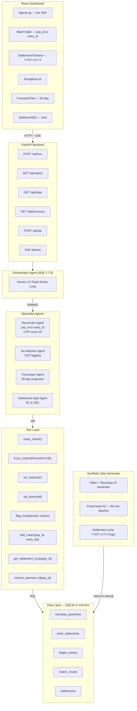
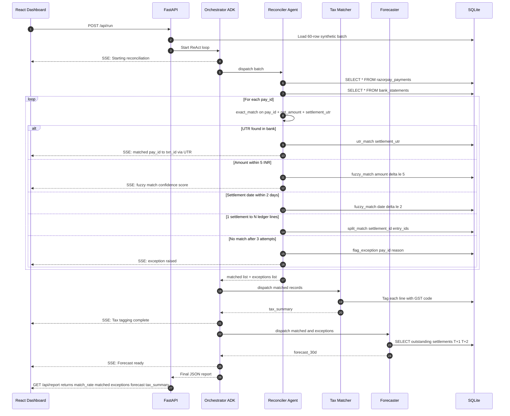
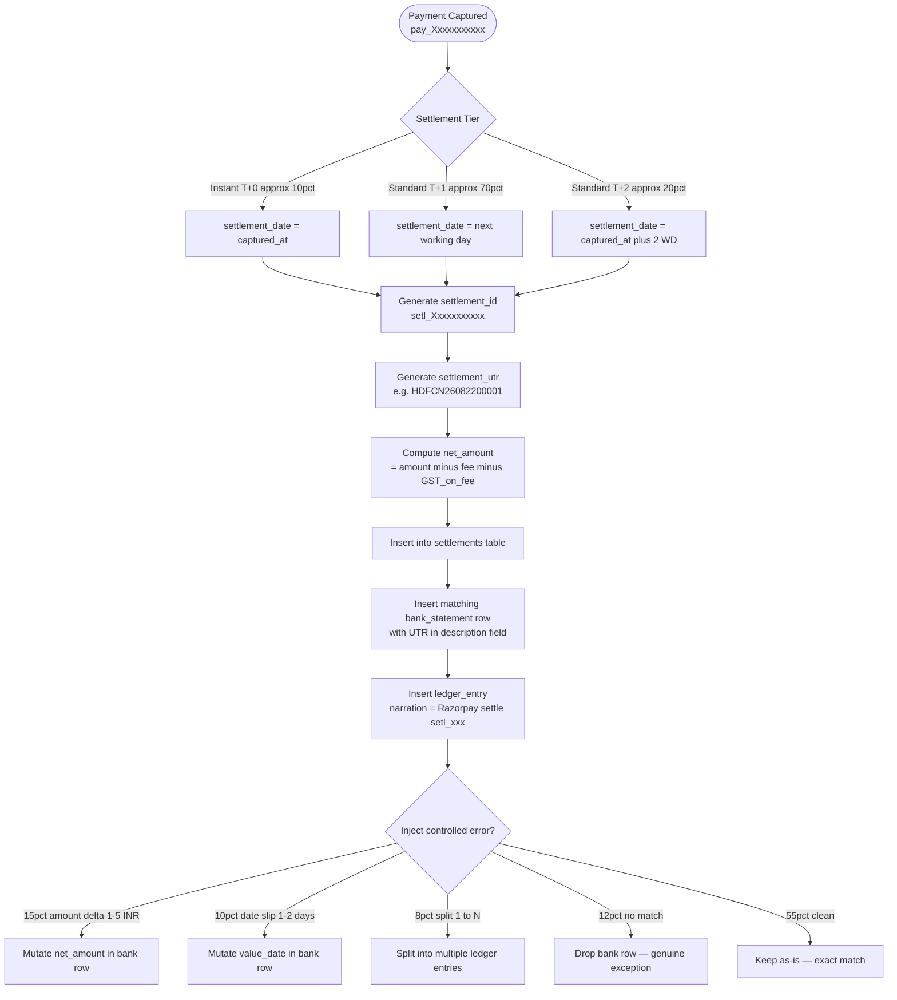
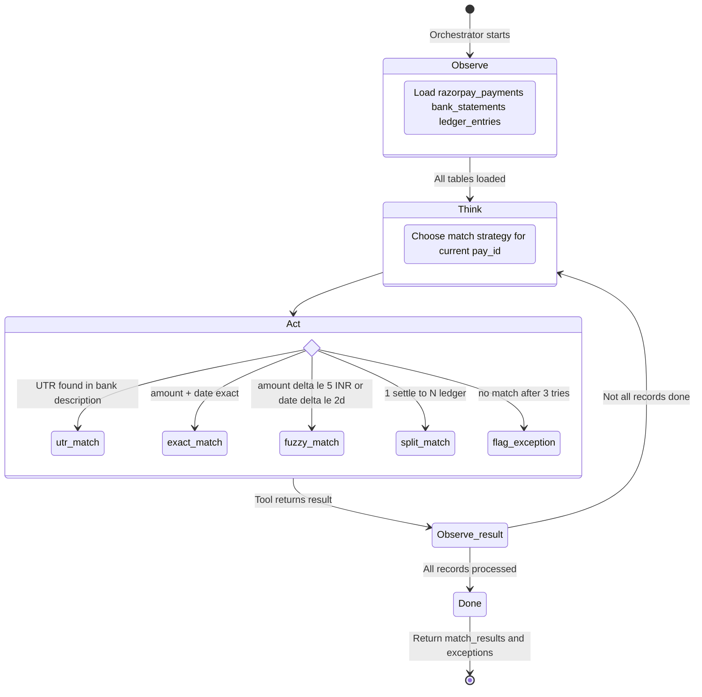

# AI Finance Controller — PLAN.md

> **Mission**: Close one full finance-ops loop across a 50+ record synthetic batch,
> reporting a measured match rate and an honest exception list — no cherry-picks.

---

## Why Now

The 2026 builder consensus is that **verification capacity, not generation speed**, is the bottleneck.
Reconciliation, settlement clearing, and forward forecasting are still done by hand in spreadsheets.
An autonomous agent that can ingest multi-source data, reason about discrepancies, self-heal
obvious mismatches, escalate genuine exceptions, and produce auditable output closes that gap.

---

## What We Are Building

An **agentic finance-ops pipeline** with four interlocked modules:

| Module | What it does |
|---|---|
| **Reconciler** | Matches Razorpay payments vs internal ledger entries (50+ records each side) |
| **Settlement Q&A Agent** | Answers natural-language questions about open/closed settlement positions |
| **Cash Forecaster** | Projects 30-day cash position from matched + outstanding items |
| **Tax-Line Matcher** | Tags each transaction to a GST/tax code and flags ambiguous ones |

The system exposes a **React dashboard** that shows live agent steps, the match table,
an exception report, and the forecast chart.

---

## Tech Stack

### Backend (Python)

| Layer | Choice | Version | Reason |
|---|---|---|---|
| Agent framework | **Google ADK** (`google-adk`) | **`==2.7.0`** (stable) | Native tool-calling, multi-agent orchestration, streaming |
| LLM | **Gemini 2.5 Flash** via `google-genai` | `>=1.16.0` | Fast, cheap, function-calling, large context for 50+ records |
| API server | **FastAPI** + `uvicorn` | `>=0.115.0` | Async, streaming SSE, easy CORS |
| Data layer | **Pandas** + in-memory SQLite (`sqlite3`) | stdlib | No infra needed; full SQL reasoning |
| Synthetic data | **Faker** + custom Razorpay generator | `>=28.0.0` | Reproducible 50+ record batches with controlled error rate |
| Validation | **Pydantic v2** | `>=2.7.0` | Typed models for every record and agent output |
| Razorpay SDK | **razorpay** | `>=1.4.2` | Payment ID generation, settlement object simulation |

> **ADK Version Lock**: Pin `google-adk==2.7.0` in `requirements.txt`. This is the latest stable release on PyPI (August 2026). ADK 2.x requires **Python >= 3.11**.

### Frontend

| Layer | Choice |
|---|---|
| Framework | **Vite + React 18** |
| Styling | **Vanilla CSS** (custom design system, dark mode) |
| Charts | **Recharts** |
| Real-time | **SSE** (`EventSource`) for streaming agent steps |

### Dev Tooling
- `pip` for Python deps (inside `.venv`, Python 3.11+)
- `.env` for `GOOGLE_API_KEY`, `RAZORPAY_KEY_ID`, `RAZORPAY_KEY_SECRET`
- Single `start.ps1` boot script

---

## Repository Layout

```
ai-finance-controller/
+-- backend/
|   +-- main.py                  # FastAPI app + orchestrator
|   +-- agents/
|   |   +-- reconciler.py        # Multi-source reconciliation agent
|   |   +-- settlement_qa.py     # Natural-language Q&A agent
|   |   +-- forecaster.py        # 30-day cash forecast agent
|   |   +-- tax_matcher.py       # Tax-line tagger agent
|   +-- data/
|   |   +-- generator.py         # Synthetic Razorpay batch generator
|   |   +-- schema.py            # Pydantic models (incl. Razorpay fields)
|   +-- tools/
|   |   +-- db_tools.py          # SQL query tools exposed to agents
|   |   +-- reconcile_tools.py   # Match, fuzzy-match, flag tools
|   |   +-- razorpay_tools.py    # Settlement lookup, payment ID resolver
|   +-- requirements.txt
+-- frontend/
|   +-- index.html
|   +-- src/
|   |   +-- App.jsx
|   |   +-- components/
|   |   |   +-- MatchTable.jsx
|   |   |   +-- ExceptionList.jsx
|   |   |   +-- ForecastChart.jsx
|   |   |   +-- AgentLog.jsx
|   |   |   +-- SettlementQA.jsx
|   |   |   +-- SettlementTimeline.jsx
|   |   +-- index.css
|   +-- package.json
+-- PLAN.md
+-- README.md
```

---

## Data Model

### Razorpay Payment Records (50+ rows)

These simulate the Razorpay Payments / Settlements API response:

```
pay_id          | TEXT    | e.g. pay_Z6t7VFTb9xHeOs  (prefix: pay_)
order_id        | TEXT    | e.g. order_MtR9aXb2cKlPq  (prefix: order_)
captured_at     | DATE    | ISO-8601 date of capture (T day)
amount          | DECIMAL | Amount in INR
currency        | TEXT    | "INR"
method          | TEXT    | upi / card / netbanking / wallet
status          | TEXT    | captured / refunded / failed
settlement_id   | TEXT    | e.g. setl_Qr8wK2mN7vJpLs  (prefix: setl_)
settlement_date | DATE    | T+0, T+1, or T+2 working days from captured_at
settlement_utr  | TEXT    | Unique Transaction Reference from bank
fee             | DECIMAL | Razorpay platform fee (INR)
tax             | DECIMAL | GST on fee
net_amount      | DECIMAL | amount - fee - tax  (lands in bank)
```

> **Settlement Cycle Rules encoded in generator**:
> - `settlement_date = captured_at + 0 days` for ~10% of records (Instant / T+0)
> - `settlement_date = captured_at + 1 working day` for ~70% of records (T+1, standard)
> - `settlement_date = captured_at + 2 working days` for ~20% of records (T+2)
> - Working-day calc skips Sundays, 2nd & 4th Saturdays, and Indian public holidays

### Bank Statement Records (50+ rows)

```
txn_id          | TEXT    | Bank-side transaction ID
value_date      | DATE    | Date credit appeared in bank
amount          | DECIMAL | INR amount credited (matches net_amount)
description     | TEXT    | UTR ref + merchant name
bank_ref        | TEXT    | UTR number (maps to settlement_utr)
currency        | TEXT    | "INR"
```

### Ledger Entries (50+ rows)

```
entry_id        | TEXT    | Internal accounting entry ID
date            | DATE    | Accounting date
amount          | DECIMAL | INR amount
narration       | TEXT    | e.g. "Razorpay settle setl_Qr8wK2mN7vJpLs"
account_code    | TEXT    | COA code (e.g. 4001, 2100)
internal_ref    | TEXT    | settlement_id or pay_id for reconciliation
```

### Match Result

```
pay_id | entry_id | match_type | confidence | delta | status
```
- `match_type` in `{exact, fuzzy_amount, fuzzy_date, utr_match, multi_split, unmatched}`
- `status` in `{matched, exception, escalated}`
- `utr_match`: bank UTR cross-referenced against Razorpay `settlement_utr`

### Settlement Summary

```
settlement_id | settlement_date | total_amount | num_payments | status
              |                 |              |              | {pending, processed, on_hold}
```

### Exception Record

```
exception_id | source | record_id | reason | agent_reasoning | suggested_action
```

---

## Architecture Diagram



---

## Flow Diagram — Reconciliation Pipeline



---

## Flow Diagram — Settlement Cycle Resolution



---

## Flow Diagram — Agent ReAct State Machine



---

## Synthetic Data Design

Controlled error injection ensures a **realistic, non-trivial batch**:

| Error type | Approx. rate | Generator behaviour |
|---|---|---|
| Exact matches (UTR + amount) | ~55% | `settlement_utr` present in both tables |
| Amount delta +/-1-5 INR (fee rounding) | ~15% | `net_amount` mutated in bank row |
| Date slip +/-1-2 days (value date vs capture) | ~10% | `value_date` mutated in bank row |
| Split payments (1 settlement to N ledger) | ~8% | One `settlement_id` maps to N `entry_id`s |
| Genuine exceptions (no bank credit found) | ~12% | Bank row dropped; ledger entry orphaned |

**Razorpay-specific ID generation** (in `data/generator.py`):

```python
import random, string, datetime

def razorpay_id(prefix: str, length: int = 14) -> str:
    """Generate a realistic Razorpay-style ID, e.g. pay_Z6t7VFTb9xHeOs"""
    chars = string.ascii_letters + string.digits
    return f"{prefix}_{''.join(random.choices(chars, k=length))}"

# Examples
pay_id        = razorpay_id("pay")    # pay_Z6t7VFTb9xHeOs
order_id      = razorpay_id("order")  # order_MtR9aXb2cKlPq
settlement_id = razorpay_id("setl")   # setl_Qr8wK2mN7vJpLs

def settlement_date(captured_at: datetime.date, tier: str) -> datetime.date:
    """Compute settlement date per Razorpay T+0/T+1/T+2 working-day rules."""
    HOLIDAYS = {datetime.date(2026, 1, 26), datetime.date(2026, 8, 15)}
    days_to_add = {"T0": 0, "T1": 1, "T2": 2}[tier]
    d = captured_at
    added = 0
    while added < days_to_add:
        d += datetime.timedelta(days=1)
        if d.weekday() == 6: continue                             # Sunday
        if d.weekday() == 5 and (d.day - 1) // 7 in (1, 3): continue  # 2nd/4th Sat
        if d in HOLIDAYS: continue
        added += 1
    return d
```

Target: **>= 75% auto-match rate**, with every exception fully explained.

---

## Phase-by-Phase Build Plan

### Phase 0 — Scaffolding (Day 1)
- [ ] Create full directory structure
- [ ] `backend/requirements.txt` with all deps (`google-adk==2.7.0`, `razorpay>=1.4.2`)
- [ ] `frontend/` initialized with Vite + React
- [ ] `.env.example` with `GOOGLE_API_KEY`, `RAZORPAY_KEY_ID`, `RAZORPAY_KEY_SECRET`
- [ ] FastAPI skeleton with `/health` endpoint
- [ ] CORS configured for local dev

### Phase 1 — Synthetic Data & Schema (Day 1-2)
- [ ] `data/schema.py`: Pydantic models for `RazorpayPayment`, `BankTxn`, `LedgerEntry`, `Settlement`, `MatchResult`, `ExceptionRecord`
- [ ] `data/generator.py`: Razorpay-realistic 60-row batches with `pay_` / `setl_` / `order_` IDs, T+0/T+1/T+2 settlement dates, UTR numbers, controlled error injection (fixed `seed=42`)
- [ ] Load all tables into in-memory SQLite on server startup
- [ ] `GET /api/data` returns raw batch as JSON for UI preview

### Phase 2 — Agent Core (Day 2-3)
- [ ] `tools/db_tools.py`: `sql_query`, `get_unmatched_payments`, `get_unmatched_entries`
- [ ] `tools/reconcile_tools.py`: `exact_match`, `fuzzy_match`, `utr_match`, `split_match`, `flag_exception`
- [ ] `tools/razorpay_tools.py`: `get_settlement_cycle(pay_id)`, `resolve_payment_id(pay_id)`, `list_pending_settlements()`
- [ ] `agents/reconciler.py`: ADK 2.7.0 agent with all tools; processes full batch using `pay_id` to `entry_id` with UTR cross-referencing
- [ ] `agents/tax_matcher.py`: Tags each matched line to GST code
- [ ] `agents/forecaster.py`: Projects next-30-day cash including T+1/T+2 pending settlements
- [ ] `agents/settlement_qa.py`: NL Q&A over match results + settlement table
- [ ] `POST /api/run` triggers orchestrator, streams steps via SSE
- [ ] `GET /api/report` returns final JSON report
- [ ] `GET /api/accuracy` returns confusion-matrix-style breakdown

### Phase 3 — Frontend Dashboard (Day 3-4)
- [ ] Design system: dark mode, color tokens, typography (Inter font)
- [ ] `AgentLog.jsx`: live SSE panel showing agent ReAct steps in real time
- [ ] `MatchTable.jsx`: sortable table; shows `pay_id`, `settlement_id`, `match_type`, `status`, color-coded
- [ ] `SettlementTimeline.jsx`: timeline view of T+0/T+1/T+2 pending vs processed settlements
- [ ] `ExceptionList.jsx`: every exception with `agent_reasoning` and `suggested_action`
- [ ] `ForecastChart.jsx`: Recharts area chart for 30-day cash (including pending settlements)
- [ ] `SettlementQA.jsx`: chat interface to query the reconciled data
- [ ] Stats bar: `match_rate %`, matched count, exception count, pending settlement amount, total volume

### Phase 4 — Polish & Accuracy Reporting (Day 4)
- [ ] Accuracy table (TP / FP / unresolved) rendered in UI alongside agent-reported rate
- [ ] Export to CSV: match results + exception list (with `pay_id`, `settlement_id`, `utr`)
- [ ] README with setup steps, run instructions, and sample output
- [ ] Final end-to-end smoke test against fresh seed

---

## Key Agent Prompt Design

### Reconciler system prompt (excerpt)
```
You are a Razorpay bank reconciliation agent. You have access to tools to query
a razorpay_payments table, a bank_statements table, and a ledger_entries table in SQLite.

Razorpay payment IDs start with "pay_", settlement IDs with "setl_", orders with "order_".
The settlement_utr in razorpay_payments should match the bank_ref in bank_statements.
Settlement dates follow T+1 or T+2 working-day cycles (T+0 for instant settlements).

Your job:
1. For each pay_id, first try utr_match() — fastest and most reliable path.
2. If UTR not found, try exact_match() on (net_amount, settlement_date +/- 0 days).
3. If amounts differ by <= 5 INR (fee rounding), use fuzzy_match().
4. If date differs by <= 2 days (settlement lag), use fuzzy_match().
5. Detect split payments: one settlement_id that sums to multiple ledger entries.
6. For anything unmatched after 3 attempts, call flag_exception() with a
   clear reason and a suggested resolution action.
7. Return a final JSON summary: { matched: [...], exceptions: [...] }

Be thorough. Process ALL records. Do not stop early.
```

---

## Accuracy & Honesty Guarantees

- Every exception **must** include `agent_reasoning` (why it could not match) and `suggested_action`
- Match rate is computed server-side from ground-truth labels baked into the generator
- UI shows **both** the agent-reported rate and the ground-truth rate side-by-side
- False positives are surfaced and counted, not hidden
- `settlement_utr` provides a deterministic ground-truth link for verification

---

## Requirements File (backend/requirements.txt)

```
# Stable ADK — pinned to tested release
google-adk==2.7.0

# LLM client
google-genai>=1.16.0

# API server
fastapi>=0.115.0
uvicorn[standard]>=0.30.0

# Data & validation
pandas>=2.2.0
pydantic>=2.7.0
faker>=28.0.0

# Razorpay SDK (payment ID schema reference + settlement simulation)
razorpay>=1.4.2

# Utilities
python-dotenv>=1.0.0
```

> **Python requirement**: 3.11 or later (ADK 2.x hard requirement)

---

## Success Criteria

| Metric | Target |
|---|---|
| Records processed | >= 50 |
| Auto-match rate | >= 75% |
| UTR-matched records | >= 50% of total (fast path) |
| Exception coverage | 100% (every unmatched record explained) |
| False positive rate | < 5% |
| Settlement cycle accuracy | T+0/T+1/T+2 dates correctly computed for all records |
| Latency per batch | < 60 seconds |
| UI streaming | Live agent steps visible during run |
